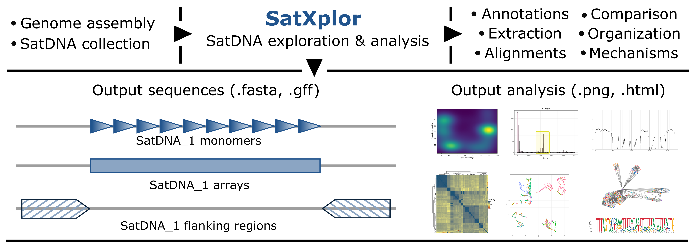

# SatXplor

Satellite DNA Exploration (SatXplor) is a bioinformatics pipeline designed for the robust characterization and analysis of satellite DNA (satDNA) elements in eukaryotic genomes. SatDNAs are highly repetitive sequences that contribute significantly to genome structure and evolution, yet they remain underexplored due to their complex and repetitive nature. SatXplor addresses this challenge by providing a comprehensive framework for the annotation and analysis of satDNA arrays and their surrounding genomic regions.

## Table of Contents

- [SatXplor](#satxplor)
  - [Table of Contents](#table-of-contents)
  - [Features](#features)
  - [Requirements](#requirements)
  - [Installation](#installation)
  - [Tests and examples](#tests-and-examples)
  - [Usage](#usage)
  - [Configuration](#configuration)
  - [Input/Output](#inputoutput)
  - [Citing](#citing)

## Features



**- Efficient annotation of satDNA monomers and arrays:** SatXplor excels in identifying tandemly repeated sequences, accurately annotating satDNA arrays even in complex genome assemblies.  
**- Genomic context analysis:** The pipeline integrates analysis of satDNA array flanking regions, providing insights into their genomic landscape.  
**- Customizable and versatile:** It can be paired with any satDNA detection tool, allowing for flexible analysis across species with varying satDNA profiles.  
**- Benchmarking:** SatXplor has been rigorously tested on curated satDNA datasets from diverse species, showcasing its adaptability to genomes with different levels of complexity.  
**- Advanced Computational Techniques:** By incorporating methods such as sequence analysis, homology investigation, clustering, and graph-based approaches, SatXplor offers unique insight into satDNA organization and evolution.  

## Requirements

**For Docker Installation (Recommended)**

To run SatXplor via Docker, the following requirements should be met:

0. Linux environment - If you're using Docker on a non-Linux OS, ensure you have a compatible Linux environment (like [WSL](https://docs.microsoft.com/en-us/windows/wsl/install) for Windows).
1. Docker - Install Docker according to the instructions for your operating system by visiting the official [Docker](https://docs.docker.com/get-docker/) website.

**For Standard Installation**

SatXplor is configured to run on any Linux system. If you prefer to install and run SatXplor manually without Docker, the following dependencies must be installed on your Linux system:

0. Linux distribution - Supporting glibc>=2.32 (ubuntu 22+).
1. NCBI Blast - Required for sequence alignment and analysis.
2. MAFFT - Necessary for multiple sequence alignment.
3. R - With the following R package dependencies: 
   1. cmake
   2. libxml2-dev
4. pip - Required for installing Python packages.
5. Mamba - For managing packages and environments.
6. Cargo - The Rust package manager.
7. pkg-config - Needed for managing library flags.

## Installation

To simplify usage, we recommend installing SatXplor via Docker. This approach streamlines the process by bypassing the need for manual dependency management and environment configuration, enabling seamless execution of the pipeline with a single command once Docker is properly installed.

**Docker Installation (Recommended)**

1. Pull the Docker containter:
    ```
    docker pull mvolaric/satxplor
    ```
2. Prepare your data directory - If you don't already have a folder for your input and output data, create one and navigate to it:
    ```
    mkdir mydata     # Create a folder named 'mydata' to store your data
    cd mydata        # Navigate to the 'mydata' folder
    pwd              # Display the full path of this directory, which you will need in the next step
    ```
3. Run the interactive shell and mount your data directory to `/mnt/data`:

    Replace `path/to/your/data_folder` with the path you got from the `pwd` command. This will mount your data folder so that it can be accessed by the Docker container.

    <span style="color:#21548d;">Once you enter the interactive shell by running the Docker command, you are effectively working inside a virtualized environment that contains all the necessary tools and libraries for SatXplor. The prompt you see (e.g., `(mypyenv) (myenv) root@54fc34881c6c:~/app#`) indicates that you are logged into this environment.</span>
    ```
    docker run -it -v path/to/your/data_folder:/mnt/data satxplor
    ```
4. Set up the configuration file:

    In the interactive shell setup your desired `run_config.json` by using the provided helper script `setup_docker_run.py`. Here’s how to customize the command:

    1. **input_genome_path genome.fasta**: Replace genome.fasta with the name of your input genome file. Ensure this file is located in your data directory.

    2. **sat_raw satellites.fasta**: Replace satellites.fasta with the name of your satellite DNA file. Again, this file should be in your data directory.

    3. **final_results_dir output_folder**: Replace output_folder with the name of the directory where you want to save the output results. This folder will be created in your mounted data directory (`mydata` in this example).
    ```
    python satxplor/setup_docker_run.py --input_genome_path genome.fasta --sat_raw satellites.fasta --final_results_dir output_folder
    ```
5. Execute the SatXplor pipeline:

    Run the `controller.py` from the interactive shell. After the run the results should be visible in the specified output folder within your data `/path/to/your/data_folder/output_folder` directory.
    ```
    python satxplor/controller.py
    ```

**Standard Installation**

If you prefer to install and run SatXplor manually without Docker, follow the steps below. This method involves cloning the repository and managing dependencies for SatXplor that is a compilation of over 10 individual scripts, and a Rust binary.

1. Clone the repository:

    ```bash
    git clone https://github.com/mvolar/SatXplor.git
    ```

2. Navigate to the project directory:

    ```bash
    cd SatXplor
    ```

3. Create and activate a virtual environment (optional but HIGHLY recommended):

    ```bash
    python -m venv venv
    source venv/bin/activate  
    ```

4. Install Python dependencies:

    ```bash
    pip install -r requirements.txt
    ```

5. Install R dependencies:

    Since the R package manager on Linux requires compilation of many packages, the installation time for all can take up to 20 minutes. Thus it is best to create a conda/mamba virtual environment and use the precompiled R packages for your Linux distribution:
    
    ```
    mamba create -n myenv r-base=4.3.3 -c conda-forge -y 

    mamba activate myenv

    mamba install -c conda-forge r-biocmanager r-ggplot2 r-data.table r-dplyr r-umap r-stringr r-factominer r-ape r-optparse r-htmlwidgets r-igraph r-networkd3 r-circlize r-pheatmap r-scales bioconda::bioconductor-biostrings bioconda::bioconductor-complexheatmap  -y 
    ```

6. (Optional) Install both MAFFT and NCBI-BLAST through mamba:

    ```
    mamba activate myenv
    mamba install -c conda-forge -c bioconda mafft blast
    ```
7. If you are running older versions of Linux systems, you need to manually compile the new Rust binary on your older system by downloading Rust:

    ```
    curl --proto '=https' --tlsv1.2 -sSf https://sh.rustup.rs | sh
    ```

8. Restart your shell then navigate to the `satxplor/satxplor/executables/` folder. Perform the following commands, and application should run normally:

    ```
    cargo build --release
    cp /target/release/kmer_edge_finder ./
    ```

## Examples

**Test Data Availability**

<span style="color:#21548d;">SatXplor includes demo files located in the `testing_data` folder, which contains two FASTA files: `test_sequence.fasta`, representing the genome sequence, and `test_sats.fasta`, containing several satDNA sequences for testing purposes.</span>

**Docker run on sample data**

To ensure that SatXplor is functioning correctly within the Docker environment, you can run the following test after pulling the Docker container. This will execute the test and allow you to inspect the output on your directory.

```
docker run -it -v path/to/your/data_folder:/mnt/data satxplor   # Run the Docker container and mount your data directory

python satxplor/run_full_tests.py                               # Execute the test script with test dataset as example

cp -r ./test_output /mnt/data/                                  # Copy the output data to your local directory for inspection
```

**Standalone script testing**

To verify that all dependencies are installed correctly and that the pipeline is functioning as expected, you can run the following tests in your local environment. The script searches for external dependencies (MAFFT, BLAST) as well as tests for all R import libraries.
``` bash
python tests/tests.py
```

**Example data run**

Additionally, SatXplor includes a small testing sample to confirm that everything runs normally and to serve. You can execute the following command, which runs on the `testing_data/testing_data.tar.gz` files, extracting the `test_sequence.fasta` and 'test_sats.fasta', setting up the run settings and running SatXplor all in one command
```
python satxplor/run_all_tests.py
```

## Usage

**Using Docker**

As explained above, set up the configuration file with paths for input genome and satellite file following by pipeline execution:
```
python satxplor/setup_docker_run.py --input_genome_path genome.fasta --sat_raw satellites.fasta --final_results_dir output_folder

python satxplor/controller.py
```
**Usage (Standalone)**

Modify the `run_config.json` to match your input files and desired output folder:

```json
{
    "INPUT_GENOME_PATH": "path/to/your/genome.fasta",       #change this path
    "GENOME_PATH": "./input.fasta",                         #this is the location of the temporary copy (no need to change)
	"SAT_RAW": "path/to/your/sats.fasta",                   #change this path
    "SAT_FASTA_PATH": "./sats.fasta",                       #this is the location of the temporary copy (no need to change)
    "FINAL_RESULTS_DIR": "/path/to/final/results/dir",      #change this path
    "OVERWRITE": true
}
```
Execute the main `controller.py` script. The results will be stored in the `FINAL_RESULTS_DIR` and `SatXplor/results`. Ensure both the **Python environment** and **Mamba environment** are active before running the pipeline:
```
(mypyenv) (myenv) python satxplor/controller.py
```
**Editing the Configuration File**

To modify the `run_config.json` file, you can use a text editor like `nano`. Run the following command to open the file in the editor:
```
nano run_config.json
```
After making changes, save the file by pressing `CTRL + O` and then press `Enter`. To exit the editor, press `CTRL + X`.

## Configuration

SatXplor allows you to customize the pipeline's behavior with a variety of command-line flags. Below are the optional arguments you can use during execution:
```
--max_plot_len          <MAX_PLOT_LEN>: Set the maximum plot length (Default: 5000).
--histogram_bin_width   <HISTOGRAM_BIN_WIDTH>: Define the histogram bin width, controlling the granularity of the histogram (Default: 50).
--nkernel_bins          <NKERNEL_BINS>: Specify the number of bins for kernel density estimation (Default: 100).
--flank_size            <FLANK_SIZE>: Determine the size of the flanking region in the analysis (Default: 500).
--array_hor_perc        <ARRAY_HOR_PERC>: Set the percentage of horizontal space used by the array (Default: 0.01).
--monomer_number        <MONOMER_NUMBER>: Specify the number of monomers considered as the array threshold (Default: 4).
--contig_filter         <CONTIG_FILTER>: Filter out contigs smaller than this value (Default: 100000).
--dimension_red_mode    <DIMENSION_RED_MODE>: Choose the mode for dimensionality reduction: "both", "pca", or "umap" (Default: "both").
--perc_id_filter        <PERC_ID_FILTER>: Set the percentage identity filter for sequences (Default: 70.0).
--qcovhsp_filter        <QCOVHSP_FILTER>: Define the query coverage filter (Default: 70.0).
--squish                <SQUISH>: Enable or disable squishing of array sequences (Default: True).
--squish_len            <SQUISH_LEN>: Specify the squish length (Default: 2500).
```
Here’s an example command that incorporates some of these flags:
```
python satxplor/controller.py --input_genome_path genome.fasta --sat_raw satellites.fasta --final_results_dir output_folder --max_plot_len 6000 --histogram_bin_width 40 --nkernel_bins 150
```

## Input/Output

**Input**

For input files, SatXplor requires only two FASTA files:

<span style="color:#21548d;">**- Genome File:**</span> A long-read based assembly in FASTA format serves as the foundation for identifying potential satDNA regions. This file can include chromosome-level assembly, contig level or even single long fragment such as singled our chromosomes.

<span style="color:#21548d;">**- Satellite DNA File:**</span>A separate FASTA file containing sequences (one or more) of potential satDNAs for the analysis.

All instructions for preparing the input files and specifying their paths are detailed in the [Installation](#installation) and [Usage](#usage) sections.

**Output**

The output of the SatXplor pipeline is organized into several key directories, each serving a specific purpose in the analysis of satDNA. The `data/` folder contains sequences and related files, including extracted monomers, aligned sequences, and annotation tables. The `kmer_analysis/` directory holds results from k-mer analyses, including k-mer data, final mapping tables, and associated visualizations.

The `pictures/` folder features graphical representations of various analyses - hierarchical organization and density plots, along with dimension reduction visualizations (PCA and UMAP). The `distances/` and `microhomology/` directories provide insights into distance metrics and conserved sequences, respectively. Finally, the `networks/` folder includes visualizations of sequence relationships.

**<span style="color:#21548d;">Here is the directory structure of the `test_output` folder generated by SatXplor for the test dataset, showcasing the organization of output files and results. Each output file is accompanied by a brief description following a `#`, providing clarity on the specific content</span>**
```
.
├── data
│   ├── extension_factors.json                                          # internal, used for creating arrays
│   ├── sequences
│   │   ├── [Cast1, Cast2, Cast3...]_monomers.fasta				        # all extracted satDNA monomers
│   │   ├── [Cast1, Cast2, Cast3...]_monomers_aligned.fasta			    # all satDNA monomers aligned
│   │   ├── [Cast1, Cast2, Cast3...]_extended_arrays.fasta			    # satDNA arrays with refined edges
│   │   ├── [Cast1, Cast2, Cast3...]_nonextended_arrays.fasta			# satDNA arrays without refined edges
│   │   ├── [Cast1, Cast2, Cast3...]_monomer_dimers.fasta			    # internal,used for the edge detection step
│   │   ├── flanks
│   │   │   ├── [Cast1, Cast2, Cast3...]_flanks.fasta				    # flanking region in XXX kb around arrays
│   │   │   ├── [Cast1, Cast2, Cast3...]_flanks_aligned.fasta			# aligned flanking regions
│   │   │   └── [Cast1, Cast2, Cast3...]_microhomology.fasta			# found microhomology seqeunces
│   └── tables
│       ├── arrays.gff                                                  # annotation of detected arrays 
│       └── blast_gff_annots.gff                                        # annotations of monomers
├── kmer_analysis
│   ├── data
│   │   ├── [test_Cast1, test_Cast2, test_Cast3...]_kmers_in_mono.txt   # raw data used for finding precise edges
│   ├── pictures
│   │   ├── [test_Cast1, test_Cast2, test_Cast3...]_rol_sum.png         # kmer analysis for each array
│   ├── final_array_table_array_maps.tsv                                # in array annotations of monomers
│   └── real_edges_in_genome.gff                                        # annotation of arrays with refined edges
├── pictures
│   ├── [Cast1, Cast2, Cast3...]_HOR.png                                # satDNA organization / HOR detection
│   ├── [Cast1, Cast2, Cast3...]_density.png                            # monomer BLAST variability analysis
│   └── dimensions
│       ├── [Cast1, Cast2, Cast3...]_aligned_matrix.csv.gz              # alignment distance matrices
│       ├── [Cast1, Cast2, Cast3...]_monomers_PCA_plot.png              # monomer clustering with PCA
│       ├── [Cast1, Cast2, Cast3...]_monomers_UMAP_plot.png             # monomer clustering with UMAP
│   └── distances
│        ├── [Cast1, Cast2, Cast3...]_flank_distance.png                # flanking region heatmaps
│   └── microhomology
│        ├── [Cast1, Cast2, Cast3...]_seqlogo.png                       # microhomology in flanking regions
│   └── networks
│        ├── [Cast1, Cast2, Cast3...]_network.html                      # array graph networks
├── blast_output.tsv
├── input.fasta                                                         # input genome assembly
├── sats.fasta                                                          # input satDNA collection
```
## Citing 

If you use SatXplor please cite the following paper:

```
SatXplor – A comprehensive pipeline for satellite DNA analyses in complex genome assemblies
Marin Volarić, Nevenka Meštrović, Evelin Despot-Slade
bioRxiv 2024.08.09.607335; doi: https://doi.org/10.1101/2024.08.09.607335
```
